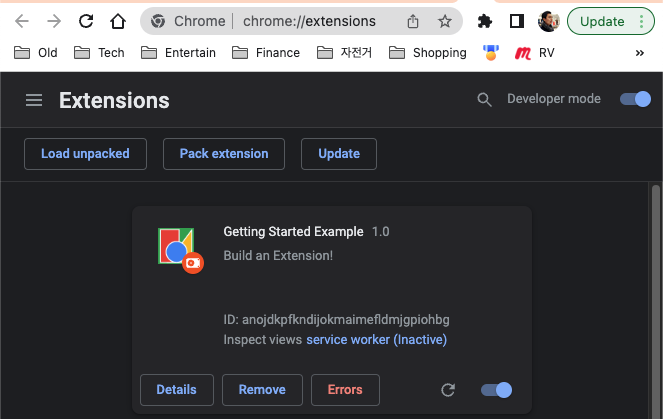
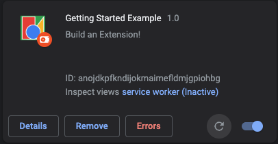
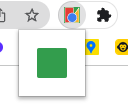
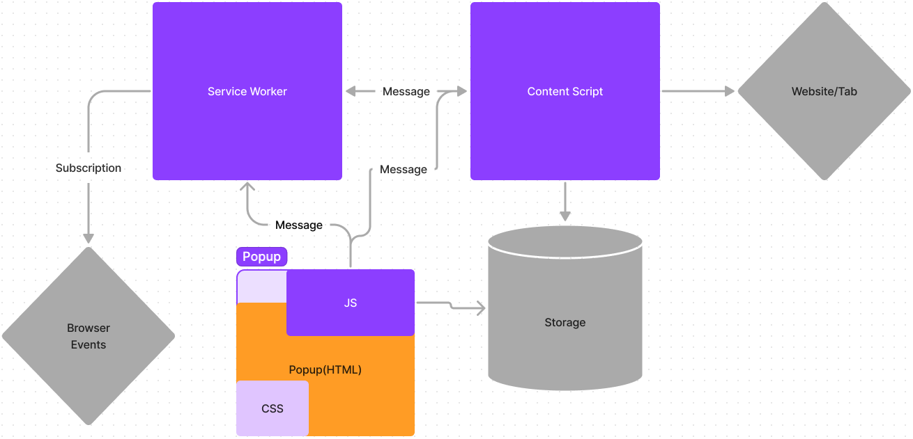

# 크롬 익스탠션 정복하기

## 크롬 소개

2021년 집계된 사용자중 크롬을 메인 브라우저로 사용하는 유저는 무려 [32억명이다](https://www.statista.com/statistics/543218/worldwide-internet-users-by-browser/#:~:text=In%202021%2C%20there%20were%20an,users%20for%20Chrome%20and%20Safari.). 2위인 사파리가 5.7억명인걸 감안하면 엄청난 숫자와 점유율이다. 크롬은 [2008년 출시](https://nira.com/chrome-history/#:~:text=Chrome%20experienced%20dramatic%20growth%20in,market%20substantially%20during%20this%20period.) 되자마자 엄청난 성장을 이루어왔다. 2014년 가장 많이 쓰이는 브라우저가 된 이후 한번도 일등을 놓친적 없고 이제는 압도적인 70프로의 점유율이 되었다. 만약 전세계 가장 많은 유저가 [사용하는 소프트웨어가](https://statisticsanddata.org/data/most-popular-pc-software/#:~:text=Microsoft%20Excel%20has%20been%20at,list%20for%20several%20years%20now.) 무엇인지 찾아보면 워드나 엑셀과 함께 크롬은 상위권을 찾이할것이다.

### 익스탠션 소개

크롬은 매달 [수차례 업데이트를](https://chromereleases.googleblog.com/) 하고 엄청나게 많은 기능들이 들어있다. 하지만 유저 숫자가 다양하고 많은 만큼 구글 혼자 유저들이 필요한 모든 기능들을 다 만들지는 못한다, 그래서 유저들이 스스로 그런 기능들을 만들고 공유할수있는 플랫폼을 만들었다. 간단하게 생각하면 크롬을 위한 구글 플레이스토어라고 생각하면 된다. 가장 많이쓰이는 익스탠션을 예를들면 광고 차단, 페이지 언어 번역, 스크린샷, 그리고 상품 가격 비교 등이 있다.

보너스로 크롬 익스탠션을 배우면 `firefox add-on` 도 쉽게 만들수 있다. 크롬과 `firefox` 는 둘다 [WebExtension API 로 만들어졌기](https://developer.mozilla.org/en-US/docs/Mozilla/Add-ons/WebExtensions/Chrome_incompatibilities) 때문이다.

## 익스탠션 만들기 ([출처](https://developer.chrome.com/docs/extensions/mv3/overview/))

크롬 익스탠션을 만드는 방법은 node 프로젝트와 비슷하다. 폴더를 만든후 manifest.json 파일을 만들고, 아래와 같은 필드가 들어있으면 된다.

    {
      "name": "Hello Extensions",
      "description": "Base Level Extension",
      "version": "1.0",
      "manifest_version": 3
    }

이후 크롬에 추가하기 위해서는 주소에 chrome://extensions/ 로 들어간후 Developer mode 클 키고 Load Package 를 눌른후 manifest.json 이 들어있는 폴더를 선택하면 된다.

하지만 이것만 가지고는 아무런 기능이 없다.

### 팝업 페이지 디자인

익스탠션을 눌렀을때 보이는 팝업을 만들기 위해서는 아래와 같은 action과 해당하는 html 파일 및 아이콘 이미지를 추가해주면 된다.

    "action": {
        "default_popup": "hello.html",
        "default_icon": "hello_extensions.png"
    }

변경후 refresh 버튼을 눌러주면 반영된다.

### 아키텍쳐 ([출처](https://developer.chrome.com/docs/extensions/mv3/architecture-overview/))

익스탠션은 크게 4가지로 나뉜다, serviceWorker(js), contentScript(js), popup(html), 그리고 storage 이다.

Service Worker: 자바스크립트를 실행할수 있으며 특정 브라우저 이벤트가 생길때마다 실행시키게 할수 있다. 크롬의 특정 API 를 사용할수 있으며 (예: 알림), `contentScript` 와도 소통할수있다. 다만 `DOM` 은 읽거나 쓸수 없다.

Content Script: 자바스립트를 실행 할 수 있으며, 이름처럼 현재 브라우저에 로드된 페이지에 삽입되면서 실행되기때문에 `DOM` 을 읽고 변경할수있다. 스토리지를 읽고 쓸수 있으며, 서비스워커와 메시지를 주고받을수 있다.

Popup: 익스탠션을 클릭했을때 조그맣게 뜨는 HTML 페이지다. 여기에는 HTML, CSS, JS 까지 포함되어 있을수 있으며, 새로운 브라우저 탭이랑 비슷하다고 생각할수 있고, service worker 처럼 `content script` 와 메시지를 주고받을수 있다.

Storage: 쉽게 말해 persistent database 이다.

예를들어 자동 번역 프로그램을 만든다고 하면
`service worker` 에서 탭이 로드되면 `content script` 에게 현재 탭 아이뒤를 `message` 를 사용해서 알려주고, `content script` 에서 현재 페이지에 있는 내용을 읽고, `google translate api` 를 통해 번역한 내용을 DOM 변경을 해주면 된다.

서비스워커와 컨탠츠스크립트는 아래와 같이 설정해주면 된다.

    "background": {
        "service_worker": "background.js"
    },
    "content_scripts": [
        {
            "matches": ["*://*/*"],
            "js": ["contentScript.js"]
        }
    ]

### permissions ([출처](https://developer.chrome.com/docs/extensions/mv3/declare_permissions/))

보안상의 이유로 민감한 기능들은 미리 공고해야만 사용할수있다. 예를 들어서 탭에 들어있는 내용을 읽거나, 스토리지를 사용, 다운로드폴더 내용 읽고쓰기, 스크린샷등 아주 많은 기능들이 있다. 필요한 기능들을 `manifest.json permissions` 에 넣어주면 된다.

    "permissions": [
        "tabs",
        "bookmarks",
        "unlimitedStorage"
    ],

### npm library 와 typescript 사용하기

chrome extension 은 기본적으로 js 에서 다른 js 을 불러오는 `require` 이나 `import` 기능을 제공하지 않기때문에 js 를 하나로 합쳐주는 `webpack` 같은 툴이 필요하다. 다행이도 이런 기능을 미리 세팅해둔 템플릿이 있고 [chrome-extension-cli](https://github.com/dutiyesh/chrome-extension-cli#readme) 같은 프로그램을 쓰면 쉽게 사용 가능하다.
소자는

    npx chrome-extension-cli {{project-name}} --language=typescript

을 사용하여 만들었다. 실행할때는

    npm run watch

을한뒤 `build` 폴더를 크롬에서 `load` 하면 되고, 완성후 퍼블리쉬를 위해 zip 을 만들때는 `npm run build` 를 돌리면 된다.

## Manifest v2 와 v3 차이점

지금까지는 버전3으로 글을 적었지만 버전2의 가이드도 많이 찾아볼수 있을 것이다. Background Script 대신 service worker, injected script 대신 contentScript 으로 대채되었다. V2가 2023년에 사용금지가 되면 ad block 이 더 어려워 질것이라는 [기사](https://www.theregister.com/2022/06/08/google_blocking_privacy_manifest/)도 있다.

## Chrome Exntension 의 미래

현재까지 대다수의 유저들은 Chrome Extension 을 적극적으로 사용하지 않는다, 너무 쉽게 해킹에 노출될수있기 때문에 저자도 아주 확실한 extension 이 아니면 깔지 않는것을 추천한다. 하지만 정말로 많은 사람들이 많은 시간을 브라우징하는데 쓰는만큼 정말 유용한 기능을 extension 을 통해 만들수 있다고 생각한다.
