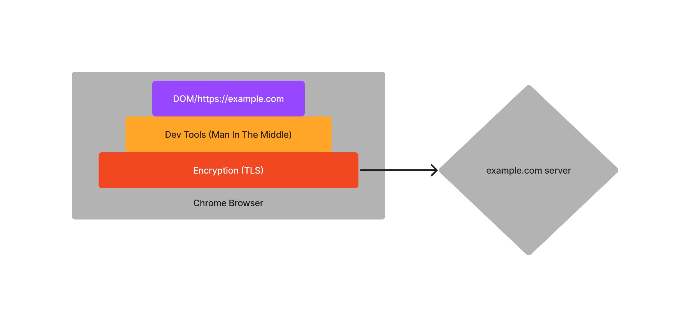
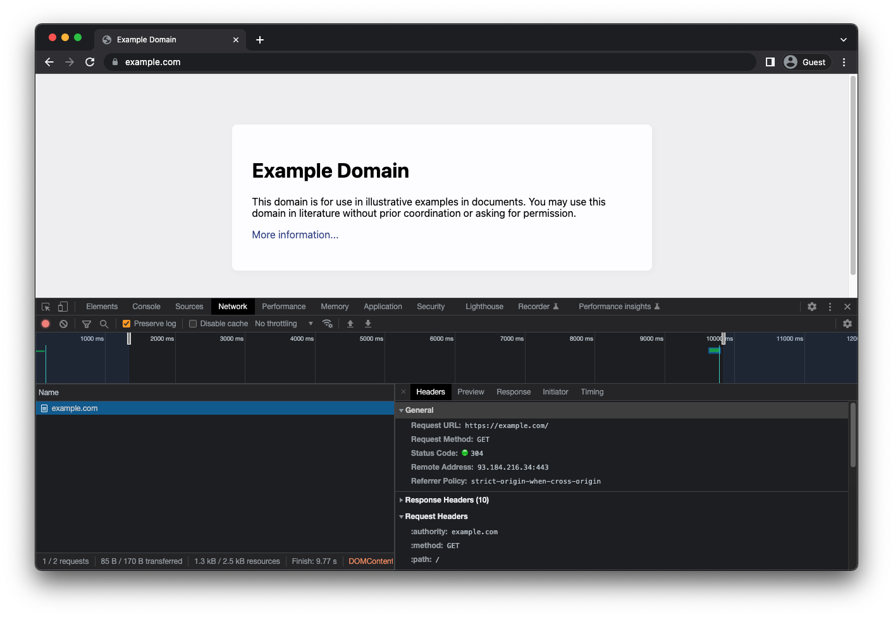
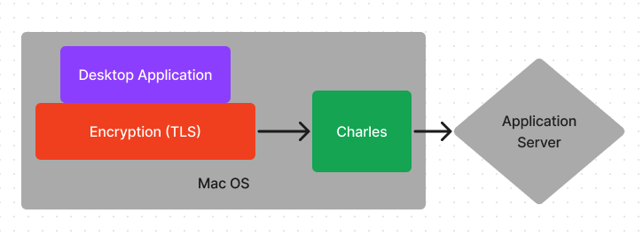
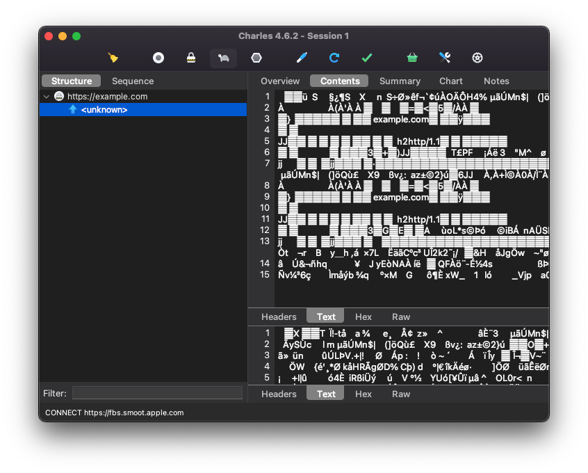
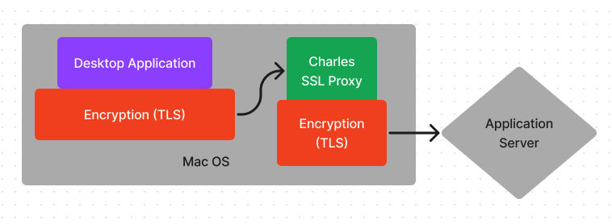
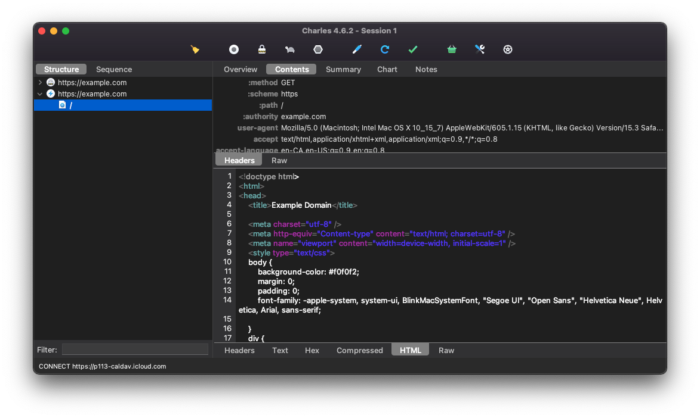
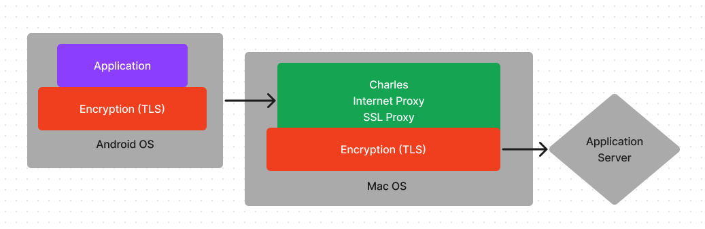

# 어플 리버스 엔지니어링 입문서

리버스 엔지니어링은 사실 난이도가 상당히 높은 분야라고 할수 있다.

이유는 원래 의도되지 않은 방식으로 다른 사람이 만든 소트프웨어를 분석해야하기 때문에 그 방식이 상당히 복잡한 경우가 많고, 짜여진 구조를 자기가 기존에 알고있는 지식과 대조하면서 이해해야하기 때문에 이미 개발에 대해 이해도가 높아야 하는 장벽도 존재한다.

그리고 해킹과 밀접한 관계가 있기때문에 사람들이 자기 노하우 공유를 꺼려한다, 안좋은 쪽으로 사용될수 있기 때문이다. 그럼에도 불구하고 저자는 지금까지 알고있는 내용들을 다 공유해드릴 예정이다.

이번에는 비교적으로 쉬운 Network Requests (HTTP Request)를 브라이저, 데스크탑, 그리고 iOS 이렇게 3가지 플랫폼에서 리버스 엔지니어링을 할 수 있는 방법들을 소개해 드릴 예정이다.

## 리버스 엔지니어링이 뭐지? [위키](https://ko.wikipedia.org/wiki/역공학)

기존 소프트웨어의 구조를 뜯어 어떻게 짜여져있는지 분석하고 이해하는 일을 말합니다. 저희는 웹사이트/소프트웨어 자체보다는 그것들이 서버와 어떻게 통신하는지 분석하는 법을 배워보려고 합니다. 배워보기 앞서 중요한 용어들을 몇개 먼저 짚어 가겠습니다.

### Man In The Middle Attack 은 뭐야? [위키](https://ko.wikipedia.org/wiki/중간자_공격)

우리가 인터넷을 사용할때 우리 신호는 아주 많은 곳을 거쳐 갑니다. 예를들어서 구글 웹사이트를 들어가면 아주 최소한으로 신호는 저희 라우터에서 저희 단지에 설치되어있는 swtich 로 가고, 거기서 저희 인터넷 서비스를 제공해주는 제공자, 거기서 구글서버에 인터넷을 제공해주는 제공자에서 구글 서버로 아주 여러단계를 거치게 됩니다. 만약 저희 신호가 악한 의도를 가지고 있는 사람을 통해서 들어간다면 그 사람은 서버에게는 저희를 사칭하고, 저희한테는 서버를 사칭하여 중간에서 모든 정보를 가로채거나 보내기전 변경할수 있습니다. TLS을 사용하면 MITM 을 방지할수 있습니다.

### TLS은 또 뭐야? [위키](https://ko.wikipedia.org/wiki/전송_계층_보안)

TLS (Transport Layer Security) 이란 보통 인터엣상에서 서로 신호를 주고 받을때 그것을 암호화 시켜서 중간단계에서 신호를 가로채 들여다봐도 내용을 이해할수 없게 만드는 암호화 통신방식 입니다. HTTP 대신 HTTPS 를 쓴다면 이 기술을 사용한 것 입니다. 통신이 시작되기 전부터 악한 의도를 가진 사람이 중간에 있을수도 있으니 이미 검증된 제 3자가 (인증사) 가 필요합니다.

### API이란? [위키](https://ko.wikipedia.org/wiki/API)

API (application programming interface)은 우리 프로그램이 다른 프로그램 (예: 서버)와 소통하기 위해 미리 개발자들이 어떤 방식으로 소통할지 결정하는 계약서 같은 것이다. 예를들어서 https://example.com/api/dogs-breeds 의 주소를 통해 get request 를 하면 json 를 아래와같이 돌려준다가 하나의 API 가 될 수가 있다.

    {
        breeds: ['afador', 'afaird', affenhuahua']
        length: 3,
        status: 'success',
    }

## 네트워크 리버스 엔지니어링

우리가 사용하고있는 모든 웹사이트, 그리고 대부분의 어플, 또는 데스크탑 프로그램들은 서버와 소통을 한다. 소통을 어떻게 하는지 잘 분석하고 이해하면, 이것을 재구현하여 우리에게 유용한 새로운 프로그램을 만들어 사용할 수 있다. 물론 네트워크 분석을 직접 하기는 전문가도 쉽지 않기때문에 대부분 이 용도에 맞게 만들어진 툴을 사용하게 된다.

### 브라우저 네트워크 리버스엔지니어링

브라우저는 리버스 엔지니어링을 가장 쉽게 할수 있는 분야이다. 왜냐면 크롬 브라우저에 dev tools 를 사용하면 리버스 엔지니어링에 필요한 모든 기능들이 이미 들어있기 때문이다.

그림과 보이는거와 같이 Dev Tools 는 유저에게 보여주는 UI 레이어와 인크립션이 되는 TLS 단계 사이에 있기때문에 모든 데이터를 암호화되지 않은 상태 그대로 볼수 있다.

크롬 브라우저에서 원하는 브라우저에 들어간후 우클릭후 inspect, 그후 Network tab 에 들어간후 다시 그 페이지를 refresh 하면 된다.



첫번째로 그 페이지를 로드할때 보냈던 http request 가 보인다. 여기서 중요한것은 General-> request url, request method, 그리고 request headers 이다.
또한 서버에서 돌아온 답변은 response headers 하고 Response 탭이 중요하다.

#### HTTP Request

그림에 example.com request 를 세세하게 분석해보려면 cURL 로 복사해보면 쉽게 볼 수 있다. example.com 우클릭후 Copy-> Copy as cURL 로 한뒤 붙여넣기 해보자

    curl 'https://example.com/' \
    -H 'authority: example.com' \
    -H 'accept: text/html,application/xhtml+xml,application/xml;q=0.9,image/avif,image/webp,image/apng,*/*;q=0.8,application/signed-exchange;v=b3;q=0.9' \
    -H 'accept-language: en-US,en;q=0.9' \
    -H 'cache-control: max-age=0' \
    -H 'if-modified-since: Thu, 17 Oct 2019 07:18:26 GMT' \
    -H 'if-none-match: "3147526947"' \
    -H 'sec-ch-ua: ".Not/A)Brand";v="99", "Google Chrome";v="103", "Chromium";v="103"' \
    -H 'sec-ch-ua-mobile: ?0' \
    -H 'sec-ch-ua-platform: "macOS"' \
    -H 'sec-fetch-dest: document' \
    -H 'sec-fetch-mode: navigate' \
    -H 'sec-fetch-site: none' \
    -H 'sec-fetch-user: ?1' \
    -H 'upgrade-insecure-requests: 1' \
    -H 'user-agent: Mozilla/5.0 (Macintosh; Intel Mac OS X 10_15_7) AppleWebKit/537.36 (KHTML, like Gecko) Chrome/103.0.0.0 Safari/537.36' \
    --compressed

-H 는 다음값은 해더라는 뜻이다. 여기서 한가지 알 수 있는 점은, 우리 브라우저는 상대 서버에게 우리의 민감할수도있는 많은 정보들을 제공해준다, 예를들어서 우리의 OS, 브라우저 버전, 언어, 쿠키, 그리고 referral(어느 주소를 타고 왔는지) 등이 있다. 비행기 티켓사들이 유저가 어떤 브라우저를 사용하는가에 따라 다르게 가격을 측정 한다고 하는데 그게 가능한 이유가 여기에 있다. 사실 여기만 보면 상대 서버에서 우리에게 필요한 정보는 한가지도 없다. 즉 curl 'https://example.com/' 만 해도 동일한 답변을 받을 수 있다.

우리가 크롬 브라우저를 그대로 사칭하고 싶다면 위에 보낸 신호와 완벽하게 동일한 신호를 보내면 된다. 실제로 터미널에서 위에 코드를 붙여넣기 해보면 브라우저와 동일한 답변이 오는것을 볼 수 있다.

위에서 이미 말했지만, https 라서 사실 모든 내용은 encryption 이 되어 있지만 dev tools 는 encryption 이 풀어지고 난 다음에 내용을 확인할수 있기에 response 를 보면 이미 다 해독되어있는 내용을 바로 볼 수 있다.

### Desktop Application Network 리버스 엔지니어링

데스크탑 어플리케이션의 네트워크를 관찰하고싶으면 TLS/SSL 암호화 때문에 난이도가 급격하게 상승하게된다. 그래도 Charles 라는 도구를 쓰면 비교적 쉽게 관찰이 가능하다.



Charles 는 보기와 같이 어플리케이션과 서버사이에 Man In The Middle 로 위치하고 있으며 주고받는 신호들을 다 관찰할수있다. 기본적으로 Charles 를 설치하고 아까와 비슷하게 https://example.com 이 어떤식을 보이는지 확인해보자.



예상했던대로 target 주소 (즉 https://example.com) 하고 패킷 사이즈등은 알수 있지만 내용이 암호화 되어있어 볼수가 없다. 자물쇠 아이콘이 암호화되어있다는 뜻이다.

여기서 Charles 는 내용을 볼수 있게 하기 위해, Application 에서 전달해준 암호된 내용을 그대로 서버에 전달하는 방식이 아닌, 자기 자신이 서버인척 위장해서 암호를 풀고, 내용을 자신의 다른 암호키로 다시 암호화하여 서버에 전달하는 방식으로 내용을 확인할수 있다. (TLS handshake 및 3자 인증은 알 필요 없어서 생략하였다)




여기서 Application은 받은 내용이 알수없는 제 3자(Charles)가 인증한것이므로 reject 를 하는 동시에 유저에게 경고를 날린다. 여기서 우리는 Charles가 암호화 한것은 3자인증 없이도 다 정상적으로 받아드려도 된다는 설정을 추가적으로 해주어야 한다. 아래 주소로 가서 macOS 절차를 따르면 된다.
https://www.charlesproxy.com/documentation/using-charles/ssl-certificates/

```
macOS
In Charles go to the Help menu and choose "SSL Proxying > Install Charles Root Certificate".
Keychain Access will open. Find the "Charles Proxy..." entry, and double-click to get info on it.
Expand the "Trust" section, and beside "When using this certificate" change it from "Use System Defaults" to "Always Trust".
Then close the certificate info window, and you will be prompted for your Administrator password to update the system trust settings.

You may need to quit and reopen Safari to see the change.
```



잘 설정을 하였다면 자물쇠 모양이 번개모양으로 바뀌면서 내용을 이제 볼 수 있는것을 알 수 있다.

### iOS/Android Application Network 리버스 엔지니어링

Mobile 어플리케이션인 경우, 기기 인터넷을 바로 라우터로 연결하는것이 아닌 Charles 가 설치되어있는 컴퓨터 아이피주소로 연결하여 인터넷 신호가 Charles 를 통해 나가도록 설정하여야 한다.



Android N (6.0) 부터는 직접 개발한 어플리케이션만 Custom Certificate 이 부여가 가능하므로 만약 Android N 이 minimum SDK 일경우 더이상 Android Application Network 를 reverse engineering 하는게 위 방법으로는 가능하지 않다. 물론 안드로이드가 오픈소스이고 기기 자체는 콘트롤할수 있기 때문에 불가능하진 않겠지만 안드로이드 전문가가 아닌이상 안드로이드는 포기하자. 만약 동일한 어플이 ios 도 출시가 되어있다면 iOS 기기를 통해 사용하자.

직접 써보진 않았지만 Charles 이외에도 [mitmproxy](https://mitmproxy.org) 라는 프로그램도 있다.

저자는 지금 당장 iOS 기기를 가지고 있지 않아서 사용법은 이 동영상으로 대체하려 한다, 양해를 부탁합니다.
https://www.youtube.com/watch?v=RchCi6E2hVs&t=3s

# 마무리 인사

시니어 개발자가 되기 위해서는 다른 개발자들이 적은 코드를 보고 배우는것이 필수라고 생각한다. 그리고 책으로만 배우는것에 끝나지 않고 직접 분석해보고 이해하는것이 꼭 필요하다고 생각한다.

저자는 20년전 어릴때 웹사이트를 들어갈때마다 가끔 소스보기를 눌러 웹사이트가 어떻게 만들어졌는지 보면서 생각하던것이 생각난다. 코딩을 전혀 몰랐지만 소스코드를 보고 신기해 했다. 하지만 이제는 그게 쉽지 않다, 웹사이트들이 너무 복잡하게 되어있어서 개발자들도 도구없이 분석하기 쉽지 않기 때문이다. 정말 안타깝다.

저자는 어릴때 많은 게임을 하면서, 내가 만약 게임을 만들었으면 이런식으로 하면 더 재밌었을탠데 라고 항상 아쉬워했었다. 그래서 추후에 게임 개발을 할 수 있는 실력이 되었을때 거의 매일매일 게임 개발만 했다, 그 아쉬움을 채우기 위해. 1년이 지나자 핸드폰 한 화면에 저자가 만든 게임어플로 가득 찼다.
또 저자는 믿업을 2012년부터 많이 나갔었다, 하지만 나가면서 아쉬운 점들이 너무 많았다, 그래서 2017년부터 직접 믿업을 운영하였다, 그 아쉬운 점들을 채우기 위해 말이다. 그리고 3년이 지나자 캐나다 최대 react 믿업이 되어 있었다.

저자는 개발자들에게 이렇게 말하고 싶다

```
인생을 즐겨라, 그리고 아쉬운 점이 있다면 직접 해결해라!
```
