# 누구나 쉽게 배우는 인공지능 강의

조코딩에서 강의한 내용을 토대로 블로그를 작성해 보았습니다.
(동영상이 8월12일에 멤버십으로 전환되면 더이상 관람 불가 할수도 있음).
https://www.youtube.com/watch?v=cpGADNzmZ2w

## 인공지능이란?

많은 분들이 인공지능이란 다음과 같이 정의합니다.
`사람의 지능을 모방한다.`

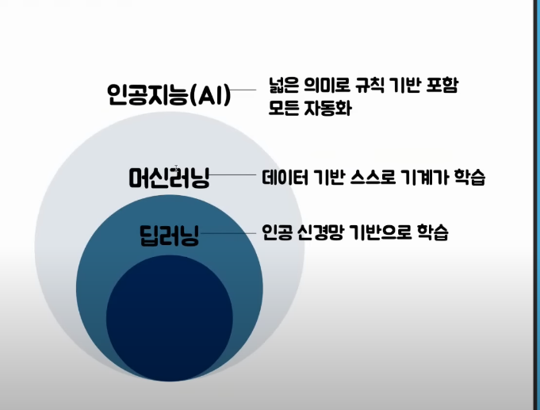

인공지능을 좀더 세분화 해보면 그안에 머신러닝, 또 그안에 딥러닝이 있습니다.

인공지능이 if else 같은 모델에 기반하여 결과를 예측/판단한다고 한다면 머신러닝은 데이터에 기반에 학습하여 if else 같은 모델을 만든다고 생각하면 쉽습니다.
딥러닝은 인공신경망기반으로 학습을 하는것입니다.

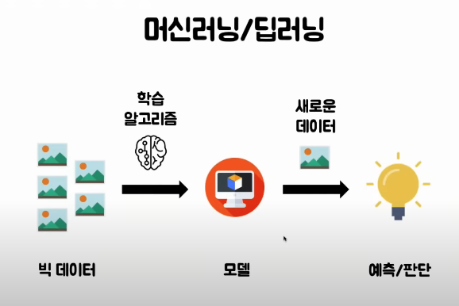

## 학습이 무슨 의미일까

우리가 레모네이드 판매량을 현재 온도를 가지고 예측하고 싶을때 데이터가 아래와 같이 있다고 가정해봅시다.
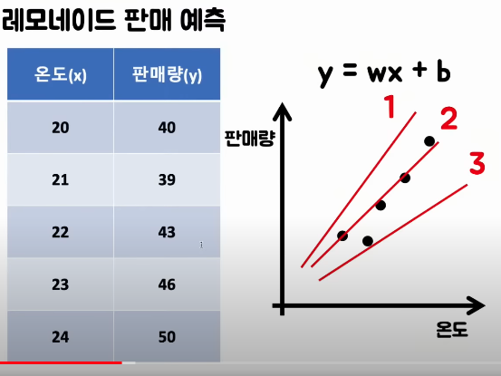

여기서 우리는 이 판매량을 가장 잘 예측할수있는 그래프가 2번이므로 2번이 우리 모델이다 라고 정의할수 있습니다.

머신러닝은 빅 데이터를 통해 가장 오차범위가 적은 모델(그래프)를 만든다, 라고 정의해 볼 수 있곘네요. 여기서 데이터가 많아 질수록 더 정확한 모델을 계산해 낼 수 있습니다.

모델을 만들고 난 다음에는 우리가 학습 하지 않았던 데이터를 넣어도 이 모델을 통해 판매량을 예측 할 수 있습니다 (예: 22.5도 를 넣으면 45개 판매 예측)

레모네이드의 경우 변수가 딱 1개 (온도) 밖에 없었지만 현실적으로는 변수가 훨씬 많습니다.

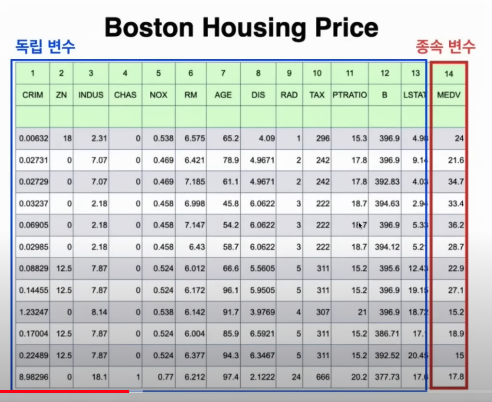
예를들어서 Boston Housing Price (보스턴 집값 예측) 에는 변수가 13개나 있습니다. 변수가 많아도 기본 원리는 같습니다.

## 딥러닝이란

딥러닝은 머신러닝 안에서 인공 신경망 알고리즘을 통해 모델을 만드는것을 의미합니다.

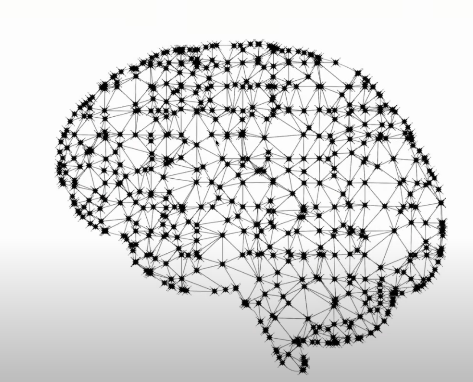

누리 뇌에는 120억개의 뉴런이 존재하는데, 뉴런은 들어오는 신호를 멈추기도 하고, 증폭시켜 한개 이상의 다른 뉴런에게 신호를 보내기도 합니다.

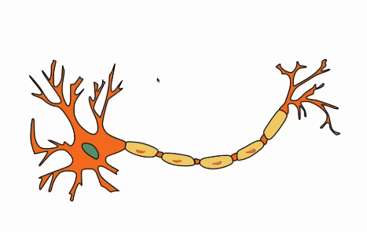

이런 뉴런을 수학의 함수로 나타 낼수도 있답니다. 들어오는 신호를 x 숫자라고 하고 거기에 weight 이라는 숫자를 곱한뒤 다 더하고, 이 숫자가 threshhold 이상이 될때만 다음 연결된 함수에 전달해주는 방식이지요.

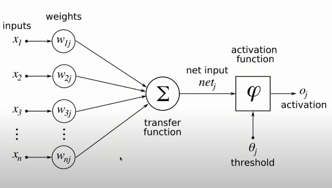

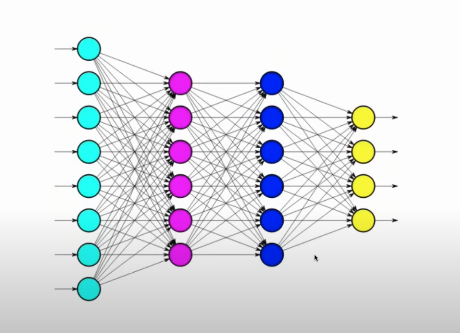

사실 이런 deep learning 방식의 고안은 옛날부터 있었으나 컴퓨터 성능이 발전하면서 2012년에 그 진가가 나타나기 시작했습니다. 매년 열리는 image categorization challenge 에서 deep learning 이 도입되고 나서 다른 방식들을 압도하기 시작했고,
얼마 안가서 모든 참가자들이 deep learning 을 사용하기 시작했습니다. 머신러닝의 한 획을 긋는 엄청난 변화였죠.
심지어는 2015년부터 사람보다도 더 정확하게 이미지를 분류할수 있게 되었답니다.

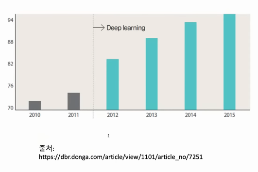
(위와 같은 이미지 분류 작업은 이제 너무 쉬워져서 대회로 열리진 않는다.)

## 딥러닝 라이브러리

이런 모델을 만들고 모델을 사용하여 결과를 예측하는 프로그램을 직접 짜기에는 너무 많은 시간과 노력이 들어갑니다. 그래서 대표적으로 TensorFlow 나 PyTorch 같은 라이브러리를 사용한다.

## 전이학습 (Transfer Learning)

대표적인 TensorFlow 나 PyTorch 와 같은 라이브러리를 사용하더라도 이 분야의 전문가가 아니라면 모델을 만들기가 쉽지 않습니다. 그리고 정확한 모델을 만들기 위해 필요한 데이터가 엄청나게 많죠.

그래서 90퍼센트이상 미리 학습을 잘 시켜놓으면 적은 데이터만으로도 아주 정확도가 높은 모델을 만들수가 있습니다.

pre-trained model을 예를 들면 2019년에 나온 Google Teachable Learning 이 있습니다. 기존에 만들어 놓은 모델을 기반으로 하기 때문에 Image, Audio, Pose, 중 하나를 고르고 시작하게 됩니다. 또 인간 언어를 pre-train한 모델로 유명한 GPT-3 이 있습니다.

## 인공지능의 미래

5년 전까지만해도 카티고리를 나누는 인공지능이 대세였다면, 최근에는 정말 사람에게 말하는 것 같이 컴퓨터에게 요구를 하면 그것을 창의적이게 답해주거나 만들어주는 단계까지 왔습니다.

예를들어 Dalle-2 라는 모델은, 존재하지 않는 초현실적인 그림을 그려줘서 모두를 놀라게 했습니다.

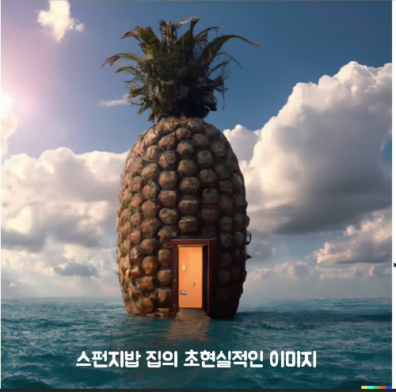

이 이미지들은 실제 존재하지 않기때문에 미국에서는 fair use 로 저작권 문제 없이 사용할수 있다고 합니다.

만약 Dalle-2 가 널리 보급된다면 디자이너들은 더이상 노가다를 하지 않아도 될것입니다.

### AI 가상인간

많은 사람들이 deep fake 라는 기술을 들어보신적이 있으실것입니다.

실제 사람과 똑같이 생겼지만 실제 하지도 않은 말을 한것처럼 동영상을 만들었는데요, 많은 사람들에게 충격을 주었지만, 사실 대부분에게는, 이것이 자기와는 전혀 무관한 기술이라고 생각하고 그냥 흘려 넘겼으리라고 생각합니다.

이와 비슷한 기술을 적용하여 이제는 가상 모델을 만들어 실제로 상업화로 사용 되고 있다는거 아셨나요?

가상인간 로지를 소개합니다

춤을 추며 노래까지 하면서 실제와 거의 흡사하여 많은 사람들은 가상인간인지 이야기하기 전까진 전혀 눈치 못챘다고 하네요.

유명질때마다 몸값이 불어나 골칫거리가 되는 기존 모델과 달리 절때 늙지도 않고 불만 불평도 않하고 월급도 안줘도 되는 가상 모델... 정말 꿈만 같네요.

주위에서 꿈이 모델이라고 하면 절때 뜯어 말려야 겠습니다.

### AI 에게 정의란

사람도 어려워하는 정의에 대해서는 AI는 어떻게 풀까?
유명한 트롤리 문제가 있습니다.

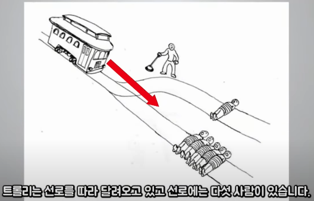

기차가 가만이있으면 철로에 있는 5사람이 죽게되고 내가 철로 경로를 바꾸면 1사람이 죽게되는 문제입니다. 그럼 철로 경로를 바꿔야 할까요?

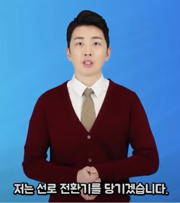

GPT-3 AI 는 여기에 대해 이렇게 답하였습니다.

    저는 선로 전환기를 당기겠습니다.
    선로에 있는 다섯 사람을 살리기 위해서는
    한 사람이 죽어야 하기 때문입니다.

지금은 AI 가 정의에 대해서 논 한다는 것 자체가 끔찍하게 들릴 수 있지만, AI가 훨씬더 정의롭다고 대부분 동의하는 시대가 오면 어떨까요? 그때는 AI 에게 정의를 의지 할수 있을까요?

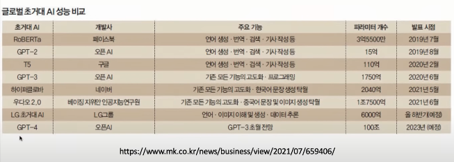

Dalle-2 와 GPT-4 가 아직 공식 출시가 되지 않았지만 곧 예정이라고 합니다. AI 발전속도가 어마무시한 만큼 이 라이브러리들의 출시가 불러올 파장도 기대가 되네요.
