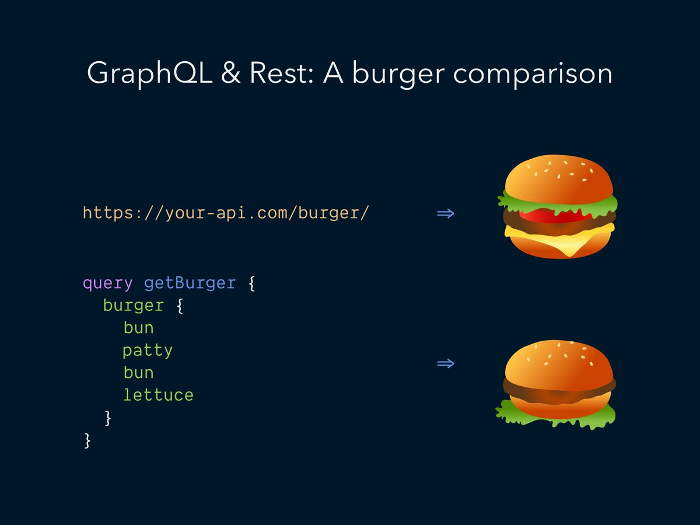

# [Which API?] 2 - GraphQL

## 1. What is GraphQL?

As the name suggests, GraphQL is a _query language_ for APIs - it provides a mechanism for the client-side to ask for exactly what they need.

GraphQL was developed internally by Facebook in 2012 before being publicly released in 2015. The origin of GraphQL comes out of Facebook's attempts to scale their mobile app.

> The main problem with Facebook’s News Feed implementation on mobile. It wasn’t as simple as retrieving a story, who wrote it, what it says, the list of comments, and who’s liked the post. Each story was interconnected, nested, and recursive. The existing APIs weren’t designed to allow developers to expose a rich, news feed-like experience on mobile. They didn’t have a hierarchical nature, let developers select what they needed, or the capability to display a list of heterogeneous feed stories.
> \- Brenda Clerk, LevelUp

Long story short, the core team at Facebook decided they needed to build a new News Feed API, which is how GraphQL began to take shape.

## 2. GraphQL vs REST

GraphQL and REST share many similarities, since GraphQL is usually implemented over HTTP. However, GraphQL uses a single endpoint to receive all client-side requests, and the actual queries are transferred as part of the body of a POST request. An example query may look like:

```GraphQL
query getBurger {
  burger {
    bun
    patty
    bun
    lettuce
  }
}
```

GraphQL supports `query` and `mutation` operations to fetch and modify data in the server, similar to REST. GraphQL supports a third operation `subscription` for event processing - the client receive updates from the server (similar to webhooks).

#### Data Fetching

In our previous post, we discussed the main limitation of REST - overfetching and underfetching. This happens because the REST endpoints return all information about a resource, and the client cannot specify their own data needs.

GraphQL tries to solve this problem by allowing clients to dictate what they want in a query and the response returned would be exactly how the client described it.

Here is a famous meme about GraphQL that describes this difference:


As you can see, when you request a burger in REST, you'd always get the same cheeseburger (fixed dataset), whereas you can request any type of burger in GraphQL.

#### Caching

The lack of a built-in caching support is a popular reason why REST API users bash on GraphQL.

In our previous post, we discussed how REST APIs utilizing HTTP caching for GET requests to save unnecessary calls to the server.

For GraphQL, utilizing HTTP cache is not possible because queries are performed using POST method. As a result, every query would invoke a network request to the server.

To mitigate this overhead, there are many libraries and frameworks that implement caching for GraphQL. For instance, a popular GraphQL client called `urql` uses the concept of _document caching_. In essence, the cache creates a hashed key from the query and its variables. For more detail, please visit [their documentation](https://formidable.com/open-source/urql/docs/basics/document-caching/).

## 3. Advantages of GraphQL

There are certain paradigms defined by GraphQL that does not exist in the REST principles.

#### Schema and Type Safety

The main advantage of GraphQL is the ability for a client to introspect the schema in a server. This schema defines all the types that are exposed in an API.

In addition, popular tools like the `GraphQL Code Generator` can automatically build all of the code out of the schema, including types, queries, mutations, etc. As a result, frontend team can utilize the generated code (goes especially well with TypeScript) and any change to the data model would be propagated back to the frontend.

#### Schema Stitching

Schema stitching combines multiple subschemas and creates a proxy layer called a gateway that a client can use to make requests. This means that you can combine smaller GraphQL schemas from different modules or even different remote services into one schema called the gateway.

For example, merging the schemas of a Burgers API and a Nutrition API by getting the details of a particular menu and the nutrition facts of the item into a single schema, from different sources.

```GraphQL
query {
  burgers(where: { name: "cheeseburger"})
  # from Menu endpoint
  name
  description
  price
  # from Nutrition endpoint
  calories
  carbohydrates
  # from Restaurant endpoint
  inStock
}
```
