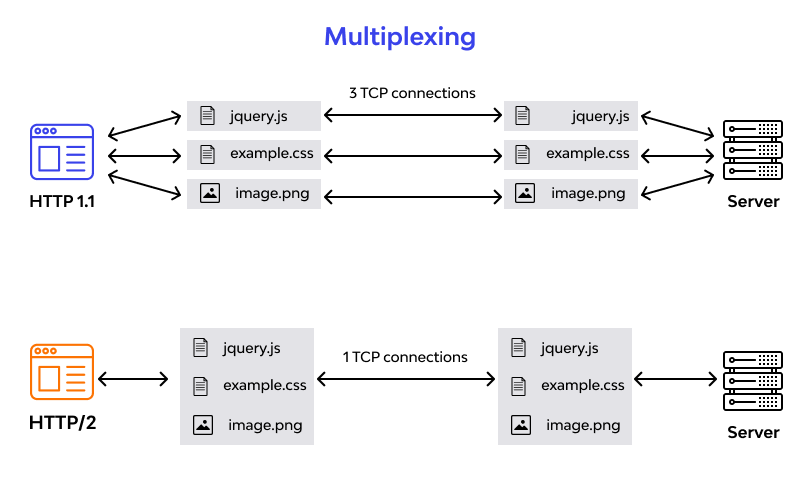

# [Which API?] 3 - gRPC

## 1. What is gRPC?

In 2015, Google started developing gRPC to connect many internal microservices created with different technologies. It was later made open-source and standardized for community use, and many leading tech companies have adopted gRPC since.

gRPC is a robust open-source RPC (Remote Procedure Call) framework used to build scalable and fast APIs. It allows the client and server applications to communicate transparently and develop connected systems. This framework relies on HTTP/2, protocol buffers, and other modern technology stacks to ensure maximum API security, performance, and scalability.

#### Protobuf

gRPC uses _Protobuf_ (Protocol Buffers) for data serialization. It is an interface definition language (IDL) that enables easy definition of services and auto-generation of client libraries.


gRPC services and messages between clients and servers are defined in `.proto` files. The Protobuf compiler, _protoc_, generates client and server code that loads the `.proto` file into the memory at runtime and uses the in-memory schema to serialize/deserialize the binary message. `.proto` files can be compiled into any supported languages.

An example `.proto` file may look like:

```Protobuf
message Person {
  optional string name = 1;
  optional int32 id = 2;
  optional string email = 3;

  enum PhoneType {
    MOBILE = 0;
    HOME = 1;
    WORK = 2;
  }

  message PhoneNumber {
    optional string number = 1;
    optional PhoneType type = 2 [default = HOME];
  }

  repeated PhoneNumber phones = 4;
}
```

The `= 1`, `= 2` markers on each element identify the unique "tag" that field uses in the binary encoding.

After the following `.proto` file is compiled into Java, it will create a `Builder` and `Message` class.

`Person` class:

```Java
// required string name = 1;
public boolean hasName();
public String getName();

// required int32 id = 2;
public boolean hasId();
public int getId();

// optional string email = 3;
public boolean hasEmail();
public String getEmail();

// repeated .tutorial.Person.PhoneNumber phones = 4;
public List<PhoneNumber> getPhonesList();
public int getPhonesCount();
public PhoneNumber getPhones(int index);
```

`Person.Builder` class:

```Java
// required string name = 1;
public boolean hasName();
public java.lang.String getName();
public Builder setName(String value);
public Builder clearName();

// required int32 id = 2;
public boolean hasId();
public int getId();
public Builder setId(int value);
public Builder clearId();

// optional string email = 3;
public boolean hasEmail();
public String getEmail();
public Builder setEmail(String value);
public Builder clearEmail();

// repeated .tutorial.Person.PhoneNumber phones = 4;
public List<PhoneNumber> getPhonesList();
public int getPhonesCount();
public PhoneNumber getPhones(int index);
public Builder setPhones(int index, PhoneNumber value);
public Builder addPhones(PhoneNumber value);
public Builder addAllPhones(Iterable<PhoneNumber> value);
public Builder clearPhones();
```

As you can see, there are simple JavaBeans-style getters and setters for each field. There are also has getters for each singular field which return true if that field has been set. Finally, each field has a clear method that un-sets the field back to its empty state.

## 2. gRPC vs REST

Let's look at the main differences between gRPC and REST.

#### HTTP/1.1 vs HTTP/2

HTTP/1.1 suffers from _head-of-line (HOL) blocking_, which is when a request at the head of the queue that cannot retrieve its required resource will block all the requests behind it. As a result, the client usually has to have several parallel TCP connections, but there are limits to the number of concurrent TCP connections possible between a client and server, and each new connection requires significant resources.



In HTTP/2, the _binary framing layer_ encodes requests/responses and cuts them up into smaller packets of information (frames), which are then mapped to messages that belong to a particular stream, all of which are _multiplexed_ within a single TCP connection. This is the foundation that enables all other features and performance optimizations provided by the HTTP/2 protocol.

#### Browser Support

As we know, REST is fully supported by all browsers and utilizes HTTP caching. gRPC has limited browser support, and it requires `gRPC-web` and a proxy layer (e.g. `Envoy`) to perform conversions between HTTP/1.1 and HTTP/2. As a result, gRPC is still mainly used for internal communication (i.e. microservices architecture).

#### Payload Data Structure

While JSON paylods on REST are human-readable, parsing with Protobuf requires fewer CPU resources since data is converted into a binary format, and encoded messages are lighter in size. So, messages are exchanged faster, even in machines with a slower CPU, such as mobile devices. In addition, the strongly typed messages can be automatically converted from Protobuf to the client and server's programming language.
