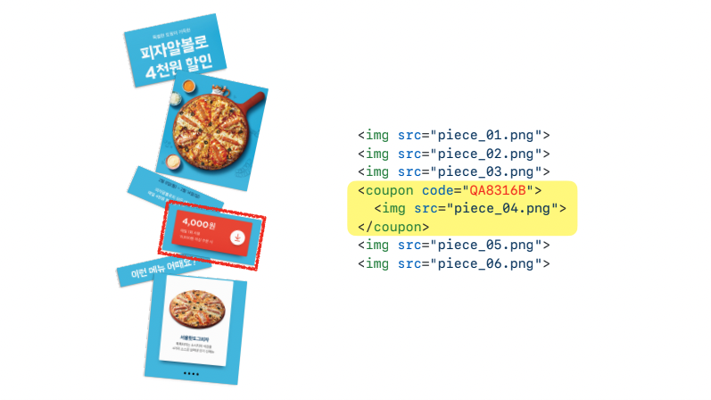
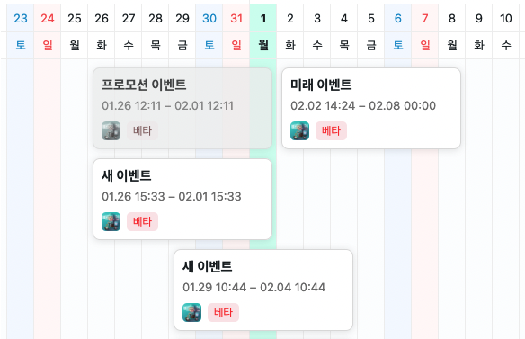
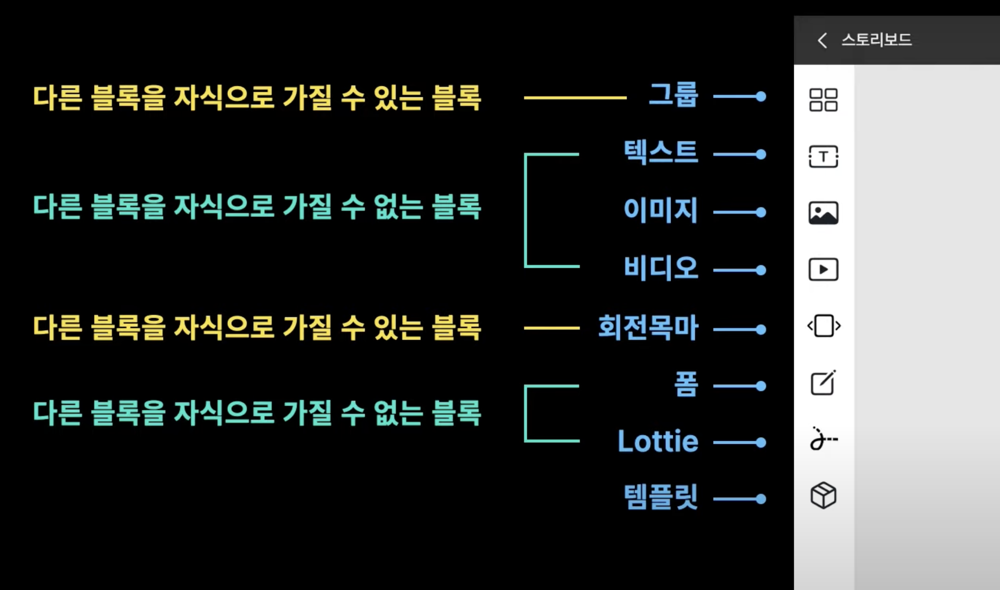
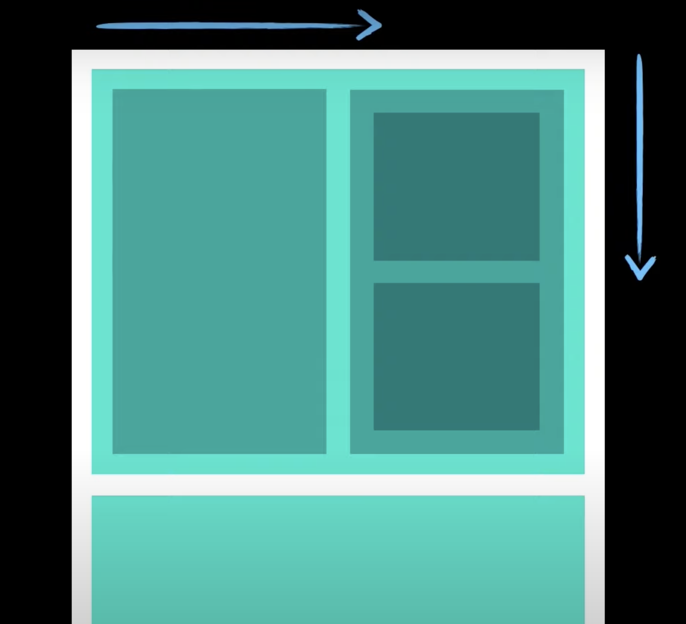
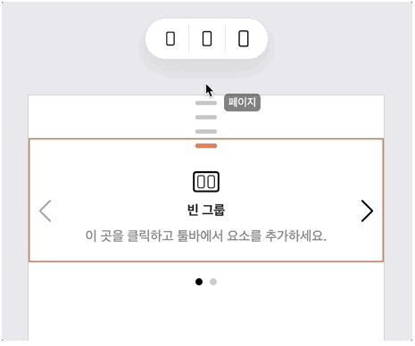
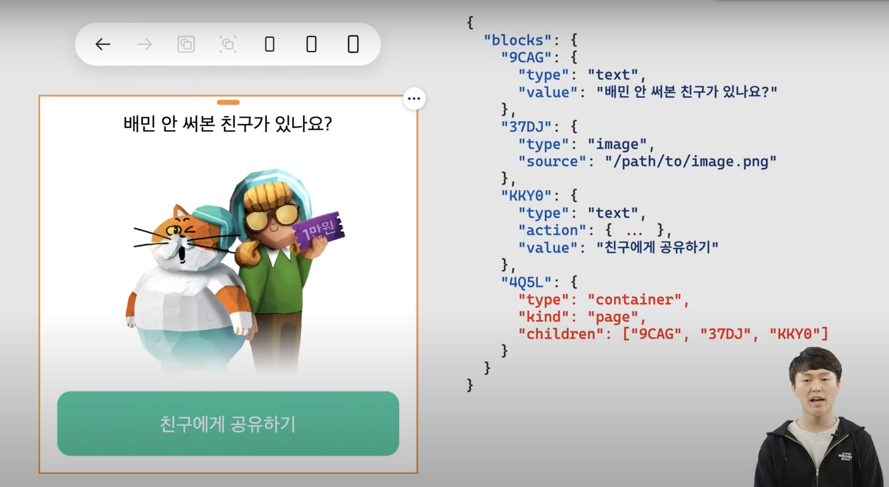

# 💡 WYSIWYG 에디터, 만다오에서 배우다

## What You See Is What You Get

### 1. 개발자 없이 웹앱을 만든다고?

#### 서론
유튜브에서 우아한 형제들 관련 컨텐츠를 가끔 찾아보는 편이다. 매우 신선하고 재미있는 프로젝트를 엿볼 수도 있고 IT 상식을 쉽게 설명해주는 영상들이 있어서다. 최근 만들어보고 싶은 서비스가 생겼는데 그게 에디터와 관련이 있어서 그와 관련된 정보를 수집하다가 배민 개발자들이 마케터를 위해 만든 백오피스 서비스인 만다오를 알게 되었다. 아쉽게 아직 오픈 소스는 아닌 것 같지만 그래도 그 컨셉과 기능이 흥미로워 우아콘 동영상과 기술 블로그를 참고해 내용을 정리해보려고 한다. 

#### 궁금증

프로그래밍을 배우고 나서 쇼핑몰 웹페이지나 앱을 보면서 없던 궁금증이 생겼다. 
- 매일, 매주 바뀌는 이 많은 이벤트 문구와 이미지, 프로모션 코드들은 개발자들이 마케팅 팀에서 받아와서 직접 넣는 건가? 
- 그럼 마케터가 기획한 대로 페이지가 나왔는지 개발자는 마케팅 팀과 왔다갔다 컨펌 받고서야 배포하는 건가?
- 아니면 마케터들이 코딩을 좀 배워서 HTML에 코드를 집어넣고 렌더링까지 확인하고 개발자에게 배포만 부탁하는 건가? 
  
- 마케팅 문구 좀 넣으려다가 엄한 코드 건드려서 에러나면 어떡하지? 

#### 답은?

위와 같은 질문은 배민 블로그를 읽고 해소되었다. 
>놀랍게도 마케터들이 직접 한다! 👀

>마케터들이 Cyberduck, FileZilla, Jenkins 등을 사용하고 있었다!

💡 여기서 Cyberduck, FileZilla는 파일 전송 프로토콜(File Transfer Protocol, 이하 FTP)을 보다 간편하게 사용할 수 있는 데스크탑 도구이다. 우리는 FTP 서버로부터 파일을 받거나 서버로 파일을 보낸다. 여러 개의 파일을 동시에 전송할 수 있고 전송 일정을 예약할 수도 있다. 
Jenkins는 지속적 통합(Continuous Integrations, 이하 CI)과 지속적 배포(Continuous Delivery, CD)를 위한 도구이다. 쉽게 말해서 모든 개발자가 각자 개발하고 프로젝트 막판에 가서 한꺼번에 통합하겠다고 하다가 에러 대환장 파티를 하는 것이 아니라 개발 중에 지속적으로 코드를 중앙 코드와 통합하고 빌드와 테스트를 진행하고, 코드가 통과하면 테스트 서버와 운영 서버에 곧바로 그 내용을 배포하는 것이다. 

하지만 당연히 코드를 복사하는 과정에서 실수가 발생할 수도 있었고 동일한 작업을 베타와 운영 두 번에 걸쳐 진행하는 번거로움이 있었다. 화면에 사용될 이미지와 배포될 결과물 파일도 직접 컨텐츠 전송 네트워크(Contents Delivery Network) 서버에 수동으로 올려야 했다. 

그래서 배민 개발자들은 마케터들이 코드 없이 이벤트 페이지를 만들 수 있는 만다오라는 [WYSIWYG](https://m.blog.naver.com/PostView.naver?isHttpsRedirect=true&blogId=mong9editor&logNo=221503735490) 방식의 웹 에디터를 개발한 것이다. 

💡 WYSIWYG는 What You See Is What You Get의 약자이다. 위지위그 에디터의 예는 블로그를 적을 때 쓰는 보통 스마트 에디터이다. 우리는 에디터 덕분에 글을 쓰며 편하게 줄바꿈을 하고 직관적으로 텍스트를 꾸미지만 사실은 `
` `` 같은 HTML 소스가 자동으로 입력되고 있는 것이다.

### 2. 만다오의 주요 기능

1. 워크스페이스에서 캘린더뷰로 프로모션을 열람하고 관리할 수 있다.
   
2. 텍스트, 이미지, YouTube, Lottie, 회전목마 등의 블록 단위로 화면을 구성하고 스타일링할 수 있다.
   
   
3. 그룹을 사용하여 복잡한 형태의 레이아웃을 만들 수 있다.
   
4. 쿠폰 다운로드 코드를 생성하고 버튼에 연결할 수 있다.
5. 프로모션 화면에 사용될 이미지 등의 파일을 자동으로 S3에 업로드합니다.
6. 베타와 운영 두 가지 배포를 재작업 없이 동시에 할 수 있다.
7. 배포 후 프로모션 URL을 제공합니다.

### 3. 따라하고 싶은 점

- 블록으로 생성하는 메타데이터: 
  
  만다오에서는 화면을 구성하는 요소 하나를 블록이라고 부르는데 모든 블록은 동일하게 Base를 상속하며 크게 Container와 Container가 아닌 것 두 가지로 구분된다. Container는 다른 블록을 자식으로 가질 수 있는 블록으로 페이지, 그룹, 슬라이드 등이 이에 해당되고 Container를 자식으로 가질 수도 있다. Container가 아닌 블록은 텍스트, 이미지, 비디오와 같은 작은 단위이다. 

  블록 안에서 텍스트나 이미지 등에 고유한 아이디가 저장되고 데이터 타입에 따라 string이나 이미지의 url이 저장된다. 데이터 타입이 container인 경우에는 children이라는 속성이 있고 배열 안에 각 블록의 고유한 아이디가 들어간다. 

  블록들은 에디터나 런타임 화면에서 이 순서에 따라 위에서 아래 또는 왼쪽에서 오른쪽으로 정렬된다. 블록은 템플릿으로 저장하여 언제든지 다시 꺼내어 쓸 수 있다. 리액트의 컴포넌트와 비슷한 개념이다. 

### 마치며

비개발자가 어쩔 수 없이 코드나 배포에 관여해야 했던 어려움을 직관적인 에디터를 개발함으로써 한 프로그램에서 모든 것을 끝낼 수 있도록 했다는 것이 인상깊었다. 그리고 에디터는 개발자가 아닌 사람들도 어렵지 않게 사용할 수 있게 직관적으로 만들어야 한다는 것을 배웠다. 만다오의 블록이 `
`와 같은 역할을 한다는 것이 매우 이해하기 쉬웠고 그 안에서 부모 안에 자식들이 담겨 캡슐화 되는 것이 재사용성이 높은 컴포넌트를 연상시켰다. 언젠가 나도 이와 비슷한 에디터를 꼭 만들고 싶다.

레퍼런스
1. [우아한평제들 기술 블로그 - 프로모션용 웹앱 빌더, 만다오](https://techblog.woowahan.com/2719/)
2. [우아콘2021 - 배민은 개발자 없이 웹앱을 만듭니다](https://www.youtube.com/watch?v=BiLa7i81BcU&t=50s&ab_channel=%EC%9A%B0%EC%95%84%ED%95%9CTech)