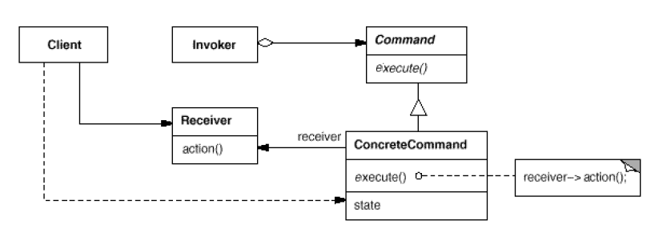

# Command design pattern

### What is Command design pattern?
**Command pattern**
- encapsulates a request as an object, thereby letting you parameterize other objects with different requests, queue or log request, and support undoable operations
- decouples the requester of an action from the object that actually performs the action

### Class diagram
<div style="text-align:center">
  
</div>

### What needs to implement
- **Command**: 
  - an interface for executing operation(s)
- **ConcreteCommand**: 
  - defines a binding between a receiver object and an action
  - implements operation(s) inherited from Command interface by invoking the corresponding operation(s) on receiver
- **Invoker**: 
  - manages a set of Command objects
  - makes requests of the corresponding operation(s) by calling Command operations
- **Receiver**
  - perform the actual implementation of execution process


### Sample code
```java
/*
  Client
*/
public class Client {
    public static void main(String[] args) {
        // Invoker
        SimpleRemoteControl src = new SimpleRemoteControl();

        // Receiver
        Light light = new Light();

        // ConcreteCommands
        LightOnCommand  lightOnCommand  = new LightOnCommand(light);
        LightOffCommand lightOffCommand = new LightOffCommand(light);

        // Receiver
        GarageDoor garageDoor = new GarageDoor();

        // ConcreteCommands
        GarageDoorOpenCommand garageDoorOpenCommand = new GarageDoorOpenCommand(garageDoor);
        GarageDoorCloseCommand garageDoorCloseCommand = new GarageDoorCloseCommand(garageDoor);

        // Invoker holds commands
        src.setCommand(1, lightOnCommand, lightOffCommand);
        src.setCommand(2, garageDoorOpenCommand, garageDoorCloseCommand);

        // Invoker invokes
        src.onButtonIsPressed(1); // prints "Light's on"
        src.offButtonIsPressed(1); // prints "Light's off"

        // Invoker invokes
        src.onButtonIsPressed(2); // prints "Garage door is opened"
        src.offButtonIsPressed(2); // prints "Garage door is closed"
    }
}

/*
 Command interface
*/
public interface Command {
    void execute();
}

/*
  Light (Receiver)
*/
public class Light {

    public void on() {
        System.out.println("Light's on");
    }

    public void off() {
        System.out.println("Light's off");
    }
}

/*
  GarageDoor (Receiver)
*/
public class GarageDoor {

    public void open() {
        System.out.println("Garage door is opened");
    }

    public void close() {
        System.out.println("Garage door is closed");
    }
}

/*
  LightOnCommand (Concrete Command)
*/
public class LightOnCommand implements Command {

    private Light light;

    public LightOnCommand(Light light) {
        this.light = light;
    }

    @Override
    public void execute() {
        light.on();
    }
}

/*
  LightOffCommand (Concrete Command)
*/
public class LightOffCommand implements Command {

    private Light light;

    public LightOffCommand(Light light) {
        this.light = light;
    }

    @Override
    public void execute() {
        this.light.off();
    }
}

/*
  GarageOpenCommand (Concrete Command)
*/
public class GarageDoorOpenCommand implements Command {

    private GarageDoor garageDoor;

    public GarageDoorOpenCommand(GarageDoor garageDoor) {
        this.garageDoor = garageDoor;
    }

    @Override
    public void execute() {
        this.garageDoor.open();
    }
}

/*
  GarageCloseCommand (Concrete Command)
*/
public class GarageDoorCloseCommand implements Command {
    private GarageDoor garageDoor;

    public GarageDoorCloseCommand(GarageDoor garageDoor) {
        this.garageDoor = garageDoor;
    }

    @Override
    public void execute() {
        this.garageDoor.close();
    }
}
```


### When to use? 
When we want to 
- parameterize objects by an action to perform (Commands pattern is an object-oriented replacement for callbacks)
- support **undo**; by storing reversed states of command executions
- support **logging changes** in case of a system crash by keeping persistent log of changes; Recovering from a crash involves reloading logged commands from disk and re-executing them

### Advantages
- decouples object that invokes the operation(invoker) from the one that knows how to perform it(receiver)
- be able to assemble multiple commands into a composite command
- easy to add new Commands

### Disadvantages
- each command is a concrete class
- thereby, a number of classes are required
