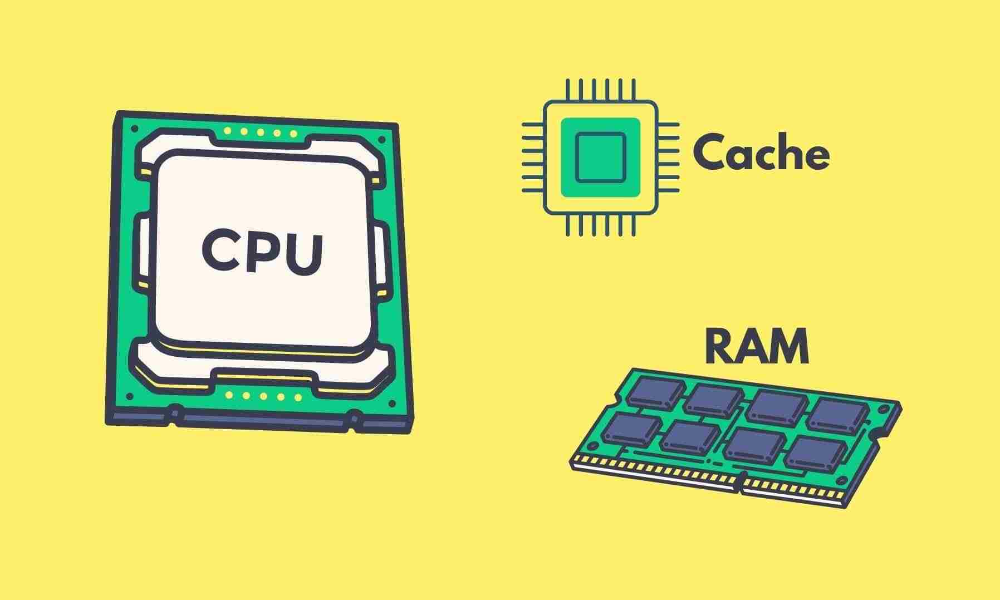
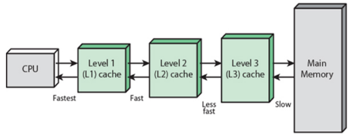

  https://bestpart.in/what-is-l1-l2-and-l3-cache/

# Cache memory

## 1. What is Cache memory?
Cache memory is a hardware used by the central processing unit(CPU) to reduce the average cost to access data from the main memory

## 2. Why do CPUs need cache memory?
The CPUs retrieves data from memory(RAM,random access memory) without any problem in the past. But while the performance of both are significantly improved, CPUs got much faster than memory. This is the problem because even if the clock speed of CPU is increased, it would still have to wait for the memory so it eventually wouldn't actually appear to get any faster.

It is still possible to create a memory that runs at the same speed of CPU, but it cost a lot since we need more space to put the memory in the circuit. There, we separated the memory into two different types of memories; the main memory(RAM) and cache memory.

Even with the cache memory, we still have problems that the cache memories are much smaller than the main memory. To overcome this problem, we again have a different types of cache memory.

## 3. Types of cache memory
#### Level1(L1) Cache
- integrates inside CPUs and exists for each core
- is fastest
- has two different cache storage; ¹ instruction cache, ² data cache

#### Level2(L2) Cache
- may reside inside CPUs or outside
- is shared by all CPUs and communicates with micro-processor through high speed bus
- is slower than L1, but has more capacity

#### Level3(L3) Cache
- not all processors have this cache
- used to enhance performance of L1 and L2
- resides outside of CPU and is shared by all CPUs
- slower than L1 and L2, but has more capacity
- still faster than DRAM

## 4. Why do we not use cache memory instead of main memory?
- Limited capacity
- Expensive compare to RAM or HDD/SSD

## 5. In what order CPU accesses cache memory

## 6. Reference
[Why do CPUs Need Caches? - Computerphile](https://www.youtube.com/watch?v=6JpLD3PUAZk)  
[Cache Memory Explained](https://www.youtube.com/watch?v=Zr8WKIOIKs)